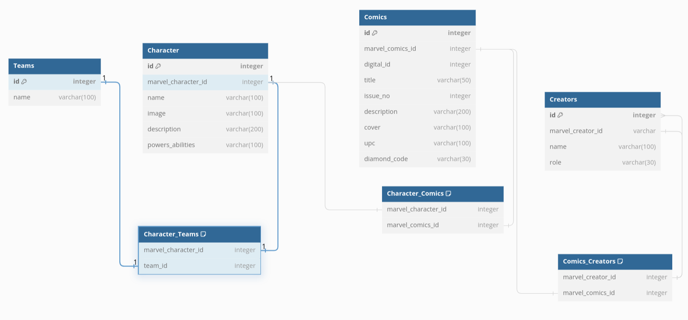

# marvel-dashboard-backend

Node.js app to update, create or delete Marvel Characters based on what the user requests. Front end portion [here](https://github.com/rzhou10/marvel-dashboard)

## Running the app

1. `npm i`
2. `npm run`
3. You can use your favorite API debugger to visit `localhost:4500/<endpoint>` to see the responses for all endpoints. A list of all routes is available in `routes/marvel.route.js`.

## Schema layout

Given the multiple many to many relationships, I've decided to create junction tables so that we can map each character to a specific team or comic, and each comic to a creator. Each junction table is indexed so to ensure speed of queries. 

